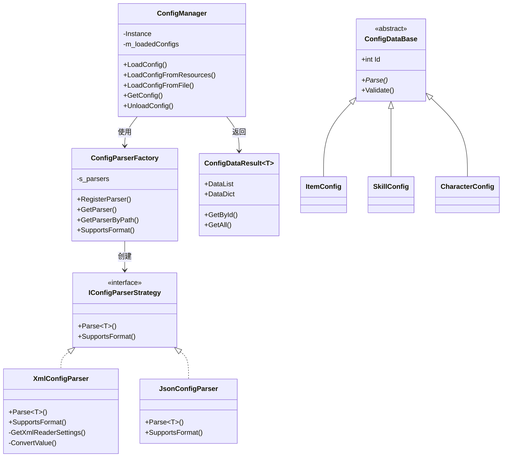
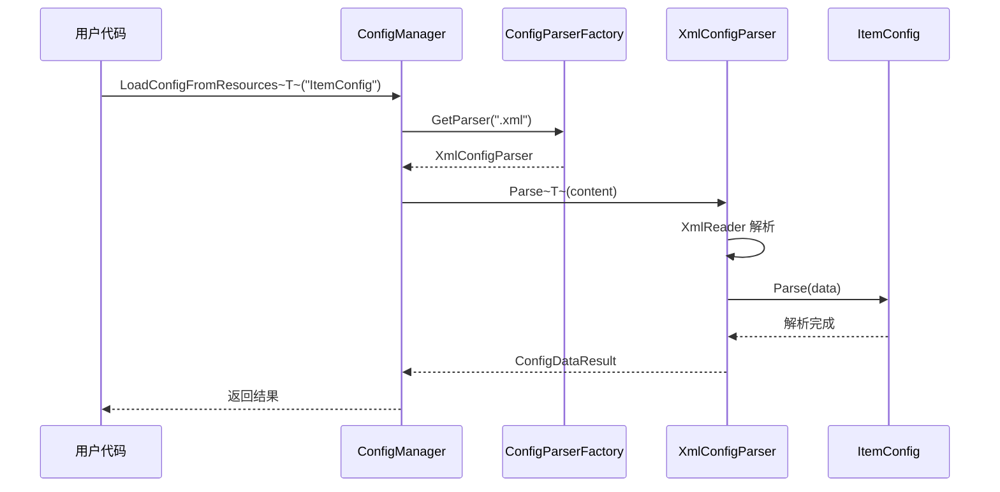

# 配置表解析管理系统

## 📁 文件结构

```
SimpleFramework/Config/
│
├── ConfigDataBase.cs              # 配置数据基类和结果类
├── IConfigParserStrategy.cs       # 策略模式 - 解析器接口
├── XmlConfigParser.cs             # 具体策略 - XML 解析器
├── JsonConfigParser.cs            # 具体策略 - JSON 解析器
├── ConfigParserFactory.cs         # 工厂模式 - 解析器工厂
├── ConfigManager.cs               # 配置管理器（单例）
├── ConfigDataExamples.cs          # 示例配置数据类
├── ConfigManagerExample.cs        # 使用示例
└── Examples/                      # 示例配置文件
    ├── ItemConfig.xml
    └── SkillConfig.json
```

## 🏗️ 设计模式

### 1. 策略模式 (Strategy Pattern)
```
IConfigParserStrategy (策略接口)
    ├── XmlConfigParser (具体策略 - XML)
    └── JsonConfigParser (具体策略 - JSON)
    └── CsvConfigParser (可扩展 - CSV)
```

### 2. 工厂模式 (Factory Pattern)
```
ConfigParserFactory (工厂类)
    ├── 注册解析器
    ├── 获取解析器
    └── 管理解析器生命周期
```

### 3. 单例模式 (Singleton Pattern)
```
ConfigManager (单例)
    └── Instance (全局访问点)
```

## 📊 类图关系



## 🔄 使用流程



## 📝 使用示例

### 加载 XML 配置
```csharp
// 从 Resources 加载
var result = ConfigManager.Instance.LoadConfigFromResources<ItemConfig>("Configs/ItemConfig");

// 获取配置
var item = result.GetById(1001);
Debug.Log($"物品：{item.ItemName}, 价格：{item.Price}");
```

### 加载 JSON 配置
```csharp
// 从文件加载
var filePath = Path.Combine(Application.streamingAssetsPath, "SkillConfig.json");
var result = ConfigManager.Instance.LoadConfigFromFile<SkillConfig>(filePath);

// 遍历所有配置
foreach (var skill in result.GetAll())
{
    Debug.Log($"技能：{skill.SkillName}");
}
```

### 异步加载
```csharp
ConfigManager.Instance.LoadConfigFromResourcesAsync<ItemConfig>(
    "Configs/ItemConfig", 
    (result) => {
        Debug.Log($"加载完成：{result.Count}条数据");
    }
);
```

## ✨ 特性

- ✅ **策略模式** - 轻松扩展新的文件格式（CSV、Binary 等）
- ✅ **工厂模式** - 统一管理解析器创建
- ✅ **单例模式** - 全局唯一的配置管理器
- ✅ **类型安全** - 泛型设计，编译时类型检查
- ✅ **高性能** - XmlReader 流式解析，避免 DOM 开销
- ✅ **易用性** - 支持 Resources、文件路径、异步加载
- ✅ **缓存机制** - 自动缓存已加载配置
- ✅ **错误处理** - 完善的异常处理和日志输出

## 🔧 扩展自定义解析器

```csharp
public class CsvConfigParser : IConfigParserStrategy
{
    public bool SupportsFormat(string extension)
    {
        return extension.Equals(".csv", StringComparison.OrdinalIgnoreCase);
    }
    
    public ConfigDataResult<T> Parse<T>(string filePath, string content) 
        where T : ConfigDataBase, new()
    {
        // 实现 CSV 解析逻辑
        var result = new ConfigDataResult<T>();
        // ... 解析代码
        result.Success = true;
        return result;
    }
}

// 注册自定义解析器
ConfigParserFactory.RegisterParser(new CsvConfigParser());
```

## 📋 配置文件格式

### XML 格式
```xml
<?xml version="1.0" encoding="UTF-8"?>
<root>
  <row Id="1001" ItemName="生命药水" Price="50" />
  <row Id="1002" ItemName="魔法药水" Price="50" />
</root>
```

### JSON 格式
```json
{
  "items": [
    {"Id": 2001, "SkillName": "火球术", "ManaCost": 50},
    {"Id": 2002, "SkillName": "冰霜新星", "ManaCost": 80}
  ]
}
```

## 🎯 最佳实践

1. **配置表命名**: 使用 PascalCase，如 `ItemConfig.xml`
2. **ID 规范**: 所有配置必须有唯一的 int 类型 ID
3. **Resources 目录**: 建议放在 `Resources/Configs/` 目录
4. **异步加载**: 大配置文件使用异步加载避免卡顿
5. **内存管理**: 不用的配置及时卸载
